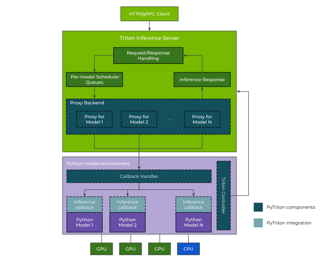

<!--
Copyright (c) 2022-2023, NVIDIA CORPORATION & AFFILIATES. All rights reserved.

Licensed under the Apache License, Version 2.0 (the "License");
you may not use this file except in compliance with the License.
You may obtain a copy of the License at

    http://www.apache.org/licenses/LICENSE-2.0

Unless required by applicable law or agreed to in writing, software
distributed under the License is distributed on an "AS IS" BASIS,
WITHOUT WARRANTIES OR CONDITIONS OF ANY KIND, either express or implied.
See the License for the specific language governing permissions and
limitations under the License.
-->

# PyTriton

PyTriton is a Flask/FastAPI-like interface that simplifies Triton's deployment in Python environments.
The library allows serving Machine Learning models directly from Python through
NVIDIA's [Triton Inference Server](https://github.com/triton-inference-server).

<!-- START doctoc generated TOC please keep comment here to allow auto update -->
<!-- DON'T EDIT THIS SECTION, INSTEAD RE-RUN doctoc TO UPDATE -->

- [Documentation](#documentation)
- [Feature matrix](#feature-matrix)
- [How it works?](#how-it-works)
- [Installation](#installation)
  - [Prerequisites](#prerequisites)
  - [Install from `pypi`](#install-from-pypi)
  - [Setting Up Python Environment](#setting-up-python-environment)
  - [Building binaries from source](#building-binaries-from-source)
- [Quick Start](#quick-start)
- [Architecture](#architecture)
- [Examples](#examples)
  - [Streaming (alpha)](#streaming-alpha)
  - [Profiling model](#profiling-model)
- [Version management](#version-management)
- [Useful Links](#useful-links)

<!-- END doctoc generated TOC please keep comment here to allow auto update -->

## Documentation

Read how to customize the Triton Inference Server, load models, deploy on clusters, and the API reference
can be found in the [documentation](https://triton-inference-server.github.io/pytriton). The below sections provide
brief information about the product and quick start guide.

## Feature matrix

| Feature | Description |
| ------- | ----------- |
| Native Python support | You can create any Python function and expose it as an HTTP/gRPC API. |
| Framework-agnostic | You can run any Python code with any framework of your choice, such as: PyTorch, TensorFlow, or JAX. |
| Performance optimization | You can benefit from dynamic batching, response cache, model pipelining, and GPU/CPU inference. |
| Easy installation and setup | You can use a simple and familiar interface based on Flask/FastAPI for easy installation and setup.  |
| Model clients   | You can access high-level model clients for HTTP/gRPC requests with configurable options and both synchronous and asynchronous API. |
| Streaming (alpha) | You can stream partial responses from a model by serving it in a decoupled mode. |

## How it works?

In PyTriton, like in Flask or FastAPI, you can define any Python function that executes a Machine Learning model prediction and exposes
it through an HTTP/gRPC API. PyTriton installs Triton Inference Server in your environment and uses it for handling
HTTP/gRPC requests and responses. Our library provides a Python API that allows you to attach a Python function to Triton
and a communication layer to send/receive data between Triton and the function. The solution enables using the
performance features of Triton Inference Server, such as dynamic batching or response cache, without changing your model
environment. Thus, it improves the performance of running inference on GPU for models implemented in Python. The solution is
framework-agnostic and can be used along with frameworks like PyTorch, TensorFlow, or JAX.

## Installation

We assume that you are comfortable with the Python programming language and familiar with Machine Learning models.
Using [Docker](https://www.docker.com/) is an option, but not mandatory.

The library can be installed in:

- system environment
- virtualenv
- [Docker](https://www.docker.com/) image

NVIDIA optimized Docker images for Python frameworks can be obtained from the [NVIDIA NGC Catalog](https://catalog.ngc.nvidia.com/containers).

If you want to use the Docker runtime, we recommend that you install [NVIDIA Container Toolkit](https://docs.nvidia.com/datacenter/cloud-native/container-toolkit/overview.html) to
enable running model inference on NVIDIA GPU.

### Prerequisites

Before installing the library, ensure that you meet the following requirements:

- An operating system with glibc >= `2.35`.
  - Triton Inference Server and PyTriton have **only** been rigorously tested on Ubuntu 22.04.
  - Other supported operating systems include Ubuntu Debian 11+, Rocky Linux 9+, and Red Hat Universal Base Image 9+.
  - To check your glibc version, run `ldd --version`
- Python version >= `3.8`
- Use `pip >= `20.3`
- Install `libpython3.*.so` in the operating system (appropriate for Python version).

### Install from `pypi`

The PyTriton can be installed from [pypi.org](https://pypi.org/project/nvidia-pytriton/) by running the following command:

```shell
pip install -U nvidia-pytriton
```

**Important**: The Triton Inference Server binary is installed as part of the PyTriton package.

More details about installation can be found in the [documentation](https://triton-inference-server.github.io/pytriton/latest/installation/).


### Setting Up Python Environment

The PyTriton requires installation and linking `libpython3.*.so`. Read more in "[Setting Up Python Environment](https://triton-inference-server.github.io/pytriton/latest/installation#setting-up-python-environment)"
for additional information how to configure system for different Python versions.

### Building binaries from source

The binary package can be built from the source, allowing access to unreleased hotfixes, the ability to modify the PyTriton code, and compatibility with various Triton Inference Server versions, including custom server builds.
For further information on building the PyTriton binary, refer to the [Building](https://triton-inference-server.github.io/pytriton/latest/building/) page of documentation.

## Quick Start

The quick start presents how to run Python model in Triton Inference Server without need to change the current working
environment. In the example we are using a simple `Linear` PyTorch model.

The requirement for the example is to have installed PyTorch in your environment. You can do it running:

```shell
pip install torch
```

The integration of model requires to provide following elements:

- The model - framework or Python model or function that handle inference requests
- Inference callback - a lambda or function which handle the input data coming from Triton and return the result
- Python function connection with Triton Inference Server - a binding for communication between Triton and Python
  callback

In the next step define the `Linear` model:

```python
import torch

model = torch.nn.Linear(2, 3).to("cuda").eval()
```

In the second step, create an inference callable as a function. The function obtains the HTTP/gRPC request data as an argument, which should be in the form of a NumPy array. The expected return object should also be a NumPy array. You can define an inference callable as a function that uses the `@batch` decorator from PyTriton. This decorator converts the input request into a more suitable format that can be directly passed to the model. You can read more about [decorators here](docs/decorators.md).

Example implementation:

<!--pytest-codeblocks:cont-->

```python
import numpy as np
from pytriton.decorators import batch


@batch
def infer_fn(**inputs: np.ndarray):
    (input1_batch,) = inputs.values()
    input1_batch_tensor = torch.from_numpy(input1_batch).to("cuda")
    output1_batch_tensor = model(input1_batch_tensor)  # Calling the Python model inference
    output1_batch = output1_batch_tensor.cpu().detach().numpy()
    return [output1_batch]
```

In the next step, you can create the binding between the inference callable and Triton Inference Server using the `bind` method from pyTriton. This method takes the model name, the inference callable, the inputs and outputs tensors, and an optional model configuration object.

<!--pytest-codeblocks:cont-->

```python
from pytriton.model_config import ModelConfig, Tensor
from pytriton.triton import Triton

# Connecting inference callable with Triton Inference Server
with Triton() as triton:
    # Load model into Triton Inference Server
    triton.bind(
        model_name="Linear",
        infer_func=infer_fn,
        inputs=[
            Tensor(dtype=np.float32, shape=(-1,)),
        ],
        outputs=[
            Tensor(dtype=np.float32, shape=(-1,)),
        ],
        config=ModelConfig(max_batch_size=128)
    )
    ...
```

Finally, serve the model with the Triton Inference Server:

<!--pytest.mark.skip-->

```python
from pytriton.triton import Triton

with Triton() as triton:
    ...  # Load models here
    triton.serve()
```

The `bind` method creates a connection between the Triton Inference Server and the `infer_fn`, which handles
the inference queries. The `inputs` and `outputs` describe the model inputs and outputs that are exposed in
Triton. The config field allows more parameters for model deployment.

The `serve` method is blocking, and at this point, the application waits for incoming HTTP/gRPC requests. From that
moment, the model is available under the name `Linear` in the Triton server. The inference queries can be sent to
`localhost:8000/v2/models/Linear/infer`, which are passed to the `infer_fn` function.

If you would like to use Triton in the background mode, use `run`. More about that can be found
in the [Deploying Models](https://triton-inference-server.github.io/pytriton/latest/initialization/) page.

Once the `serve` or `run` method is called on the `Triton` object, the server status can be obtained using:

<!--pytest.mark.skip-->

```shell
curl -v localhost:8000/v2/health/live
```

The model is loaded right after the server starts, and its status can be queried using:

<!--pytest.mark.skip-->

```shell
curl -v localhost:8000/v2/models/Linear/ready
```

Finally, you can send an inference query to the model:

<!--pytest.mark.skip-->

```shell
curl -X POST \
  -H "Content-Type: application/json"  \
  -d @input.json \
  localhost:8000/v2/models/Linear/infer
```

The `input.json` with sample query:

```json
{
  "id": "0",
  "inputs": [
    {
      "name": "INPUT_1",
      "shape": [1, 2],
      "datatype": "FP32",
      "parameters": {},
      "data": [[-0.04281254857778549, 0.6738349795341492]]
    }
  ]
}
```

Read more about the HTTP/gRPC interface in the Triton Inference Server
[documentation](https://github.com/triton-inference-server/server/blob/main/docs/customization_guide/inference_protocols.md#httprest-and-grpc-protocols).

You can also validate the deployed model using a simple client that can perform inference requests:

<!--pytest.mark.skip-->

```python
import torch
from pytriton.client import ModelClient

input1_data = torch.randn(128, 2).cpu().detach().numpy()

with ModelClient("localhost:8000", "Linear") as client:
    result_dict = client.infer_batch(input1_data)

print(result_dict)
```

The full example code can be found in [examples/linear_random_pytorch](examples/linear_random_pytorch).

You can learn more about client usage in the [Clients](https://triton-inference-server.github.io/pytriton/latest/clients/) document.

More information about running the server and models can be found
in [Deploying Models](https://triton-inference-server.github.io/pytriton/latest/initialization/) page of documentation.

## Architecture

The diagram below presents the schema of how the Python models are served through Triton Inference Server using
PyTriton. The solution consists of two main components:

- Triton Inference Server: for exposing the HTTP/gRPC API and benefiting from performance features like dynamic batching
  or response cache.
- Python Model Environment: your environment where the Python model is executed.

The Triton Inference Server binaries are provided as part of the PyTriton installation. The Triton Server is
installed in your current environment (system or container). The PyTriton controls the Triton Server process
through the `Triton Controller`.

Exposing the model through PyTriton requires the definition of an `Inference Callable` - a Python function that is
connected to Triton Inference Server and executes the model or ensemble for predictions. The integration layer binds
the `Inference Callable` to Triton Server and exposes it through the Triton HTTP/gRPC API under a provided `<model name>`. Once
the integration is done, the defined `Inference Callable` receives data sent to the HTTP/gRPC API endpoint
`v2/models/<model name>/infer`. Read more about HTTP/gRPC interface in Triton Inference Server
[documentation](https://github.com/triton-inference-server/server/blob/main/docs/customization_guide/inference_protocols.md#httprest-and-grpc-protocols).

The HTTP/gRPC requests sent to `v2/models/<model name>/infer` are handled by Triton
Inference Server. The server batches requests and passes them to the `Proxy Backend`, which sends the batched requests to the appropriate
`Inference Callable`. The data is sent as a `numpy` array. Once the `Inference Callable` finishes execution of
the model prediction, the result is returned to the `Proxy Backend`, and a response is created by Triton Server.




## Examples

The [examples](examples) page presents various cases of serving models using PyTriton. You can find simple examples of
running PyTorch, TensorFlow2, JAX, and simple Python models. Additionally, we have prepared more advanced scenarios like online
learning, multi-node models, or deployment on Kubernetes using PyTriton. Each example contains instructions describing
how to build and run the example. Learn more about how to use PyTriton by reviewing our [examples](examples).

### Streaming (alpha)

We introduced new alpha feature to PyTriton that allows to stream partial responses from a model. It is based on NVIDIA Triton Inference deocoupled models feature. Look at example in [examples/huggingface_dialogpt_streaming_pytorch](examples/huggingface_dialogpt_streaming_pytorch).

### Profiling model

The [Perf Analyzer](https://github.com/triton-inference-server/client/blob/main/src/c++/perf_analyzer/README.md) can be
used to profile models served through PyTriton. We have prepared an example of
using the Perf Analyzer to profile the BART PyTorch model. The example code can be found
in [examples/perf_analyzer](examples/perf_analyzer).

## Version management

PyTriton follows the [Semantic Versioning](https://semver.org/) scheme for versioning. Official releases can be found on [PyPI](https://pypi.org/project/nvidia-pytriton/) and [GitHub releases](https://github.com/triton-inference-server/pytriton/releases). The most up-to-date development version is available on the `main` branch, which may include hotfixes that have not yet been released through the standard channels. To install the latest development version, refer to the instructions in the
[building binaries from source](#building-binaries-from-source) section.

## Useful Links

- [Changelog](CHANGELOG.md)
- [Known Issues](https://triton-inference-server.github.io/pytriton/latest/known_issues)
- [Contributing](CONTRIBUTING.md)
