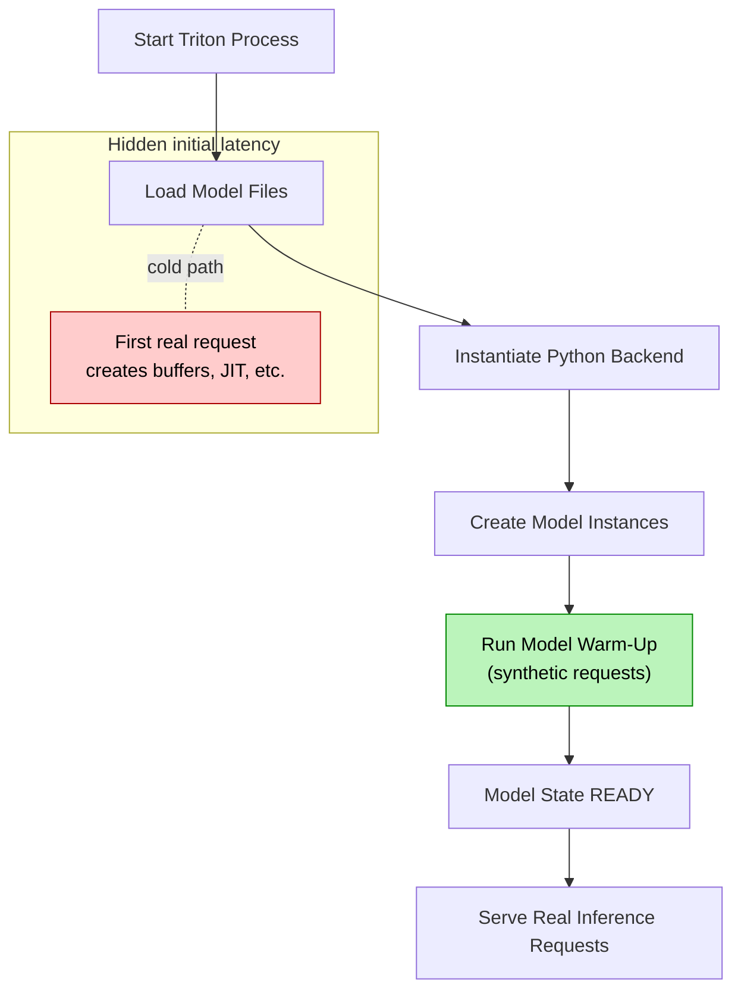

<!--
Copyright (c) 2022-2023, NVIDIA CORPORATION & AFFILIATES. All rights reserved.

Licensed under the Apache License, Version 2.0 (the "License");
you may not use this file except in compliance with the License.
You may obtain a copy of the License at

    http://www.apache.org/licenses/LICENSE-2.0

Unless required by applicable law or agreed to in writing, software
distributed under the License is distributed on an "AS IS" BASIS,
WITHOUT WARRANTIES OR CONDITIONS OF ANY KIND, either express or implied.
See the License for the specific language governing permissions and
limitations under the License.
-->
# Binding Configuration

The additional configuration of binding the model for running a model through the Triton Inference Server can be
provided in the `config` argument in the `bind` method. This section describes the possible configuration enhancements.
The configuration of the model can be adjusted by overriding the defaults for the `ModelConfig` object.

```python
from pytriton.model_config.common import DynamicBatcher

class ModelConfig:
    batching: bool = True
    max_batch_size: int = 4
    batcher: DynamicBatcher = DynamicBatcher()
    response_cache: bool = False
```

## Batching

The batching feature collects one or more samples and passes them to the model together. The model processes
multiple samples at the same time and returns the output for all the samples processed together.

Batching can significantly improve throughput. Processing multiple samples at the same time leverages the benefits of
utilizing GPU performance for inference.

The Triton Inference Server is responsible for collecting multiple incoming requests into a single batch. The batch is
passed to the model, which improves the inference performance (throughput and latency). This feature is called
`dynamic batching`, which collects samples from multiple clients into a single batch processed by the model.

On the PyTriton side, the `infer_fn` obtain the fully created batch by Triton Inference Server so the only
responsibility is to perform computation and return the output.

By default, batching is enabled for the model. The default behavior for Triton is to have dynamic batching enabled.
If your model does not support batching, use `batching=False` to disable it in Triton.

## Maximal batch size

The maximal batch size defines the number of samples that can be processed at the same time by the model. This configuration
has an impact not only on throughput but also on memory usage, as a bigger batch means more data loaded to the memory
at the same time.

The `max_batch_size` has to be a value greater than or equal to 1.

## Dynamic batching

The dynamic batching is a Triton Inference Server feature and can be configured by defining the `DynamicBatcher`
object:

```python
from typing import Dict, Optional
from pytriton.model_config.common import QueuePolicy

class DynamicBatcher:
    max_queue_delay_microseconds: int = 0
    preferred_batch_size: Optional[list] = None
    preserve_ordering: bool = False
    priority_levels: int = 0
    default_priority_level: int = 0
    default_queue_policy: Optional[QueuePolicy] = None
    priority_queue_policy: Optional[Dict[int, QueuePolicy]] = None
```

More about dynamic batching can be found in
the [Triton Inference Server documentation](https://github.com/triton-inference-server/server/blob/main/docs/user_guide/model_configuration.md#dynamic-batcher)
and [API spec](reference/model_config.md)

## Decoupled models

Triton can [support models that send multiple responses for a request or zero responses for a request](https://github.com/triton-inference-server/server/blob/main/docs/user_guide/decoupled_models.md). A decoupled model may also send responses out-of-order relative to the order that the request batches are executed. This allows backend to deliver response whenever it deems fit.

To enable this feature, set `decoupled=True` in `ModelConfig`.

## Response cache

The Triton Inference Server provides functionality to use a cached response for the model. To use the response cache:

- provide the `cache_config` in `TritonConfig`
- set `response_cache=True` in `ModelConfig`

More about response cache can be found in the [Triton Response Cache](https://github.com/triton-inference-server/server/blob/main/docs/user_guide/response_cache.md) page.

Example:

<!--pytest.mark.skip-->
```python
import numpy as np

from pytriton.decorators import batch
from pytriton.model_config import ModelConfig, Tensor
from pytriton.triton import Triton, TritonConfig

triton_config = TritonConfig(
    cache_config=[f"local,size={1024 * 1024}"],  # 1MB
)

@batch
def _add_sub(**inputs):
    a_batch, b_batch = inputs.values()
    add_batch = a_batch + b_batch
    sub_batch = a_batch - b_batch
    return {"add": add_batch, "sub": sub_batch}

with Triton(config=triton_config) as triton:
    triton.bind(
        model_name="AddSub",
        infer_func=_add_sub,
        inputs=[Tensor(shape=(1,), dtype=np.float32), Tensor(shape=(1,), dtype=np.float32)],
        outputs=[Tensor(shape=(1,), dtype=np.float32), Tensor(shape=(1,), dtype=np.float32)],
        config=ModelConfig(max_batch_size=8, response_cache=True)
    )
    ...
```

## Model Warm‑Up

> *Added in PyTriton ≥ 0.6*

Model warm‑up lets Triton issue **synthetic inference requests** immediately after a model is loaded, so that expensive one‑time initialisation (CUDA graph capture, JIT compilation, weight transfer, kernel autotuning, …) happens **before the first real user request**.
The result is **stable and predictable latency** from the very first inference, which is critical for on‑line and multi‑tenant deployments.

**Q: Does warm‑up block the process?**
A: Yes. Triton waits synchronously; therefore warm‑up should be *fast* (≤ a few seconds) and run only the absolutely necessary shapes.




Without warm‑up, the dashed *cold path* executes on the first user request (`H`).
With warm‑up enabled, step `E` is executed automatically during start‑up, ensuring the public state becomes `READY` **only after** the costly initialisation is finished.


### When should you warm‑up a model ?

| Symptom observed without warm‑up                                       | Root cause                                                            | Warm‑up effect                                              |
| ---------------------------------------------------------------------- | --------------------------------------------------------------------- | ----------------------------------------------------------- |
| First request is several × slower than the median p50                  | Lazy JIT / kernel compilation, CUDA graph capture, memory pool growth | Executes once during start‑up rather than during production |
| First batch allocates large page‑locked buffers                        | Page‑locked pool not yet initialised                                  | Buffers are allocated during warm‑up                        |
| TRT‐optimised model builds first time it is asked for a given shape    | TensorRT engine caching                                               | Required shapes are built up‑front                          |
| Scaling to N identical replicas shows a latency spike on every replica | Per‑replica initialisation                                            | Warm‑up hides the spike and synchronises replicas           |

### API reference

Two data classes have been introduced in **`pytriton.model_config.common`**:

<!--pytest.mark.skip-->
```python
@dataclasses.dataclass
class WarmupInput:
    dtype: Union[Type[np.dtype], Type[object]]
    shape: Sequence[int]

    # One of the three flags **must** be True.
    zero_data: bool = False          # Fill tensor with all‑zeros
    random_data: bool = False        # Fill with reproducible PRNG data
    input_data_file: Optional[str]   # Load binary/NPY file from disk
```

<!--pytest.mark.skip-->
```python
@dataclasses.dataclass
class ModelWarmup:
    name: str                        # Friendly identifier (visible in logs)
    batch_size: int                  # Per‑warm‑up request batch size
    inputs: Dict[str, WarmupInput]   # Keyed by *input tensor name*
    count: int                       # How many requests to send
```

`ModelConfig` has a new optional field:

<!--pytest.mark.skip-->
```python
class ModelConfig:
    ...
    model_warmup: Optional[List[ModelWarmup]] = None
```

### Minimal warm‑up example

```python
import numpy as np
from pytriton.decorators import batch
from pytriton.triton import Triton
from pytriton.model_config import ModelConfig, Tensor
from pytriton.model_config.common import ModelWarmup, WarmupInput

@batch
def infer_fn(INPUT_1, INPUT_2):
    return {"OUTPUT_1": np.ones((1,1), dtype=np.float32)}
    
# 1. Describe the warm‑up traffic pattern
warmup = ModelWarmup(
    name="first-batch",
    batch_size=1,
    inputs={
        "INPUT_1": WarmupInput(dtype=np.float32, shape=(1,), random_data=True),
        "INPUT_2": WarmupInput(dtype=np.bytes_, shape=(1,), zero_data=True),
    },
    count=1,            # run two synthetic requests
)

# 2. Attach it to the model’s config
config = ModelConfig(
    max_batch_size=16,
    model_warmup=[warmup],
)

# 3. Bind the model as usual
triton = Triton()
triton.bind(
    model_name="MyModel",
    infer_func=infer_fn,          # your @batch function
    inputs=[
        Tensor(dtype=np.float32, shape=(1,)),
        Tensor(dtype=np.bytes_,  shape=(1,)),
    ],
    outputs=[Tensor(dtype=np.float32, shape=(1,))],
    config=config,
    strict=True,
)
triton.run()
```


<!--pytest-codeblocks:cont-->
<!--
Test server:

```python
from pytriton.client import ModelClient

client = ModelClient("localhost", "MyModel")
data_float = np.ones((1,), dtype=np.float32)
data_bytes = np.ones((1,), dtype=np.bytes_)
print(client.infer_sample(INPUT_1=data_float, INPUT_2=data_bytes))
```
-->

<!--pytest-codeblocks:cont-->
<!--
Clean resources for code block

```python
client.close()
triton.stop()
```
-->


### Multiple warm‑up stages

You may specify several `ModelWarmup` blocks to emulate different request shapes:

```python
import numpy as np
from pytriton.model_config import ModelConfig, Tensor
from pytriton.model_config.common import ModelWarmup, WarmupInput
config = ModelConfig(
    max_batch_size=32,
    model_warmup=[
        ModelWarmup(
            name="bs16-seq32",
            batch_size=16,
            inputs={"tokens": WarmupInput(np.int32, (32,), random_data=True)},
            count=1,
        ),
        ModelWarmup(
            name="bs1-seq512",
            batch_size=1,
            inputs={"tokens": WarmupInput(np.int32, (512,), random_data=True)},
            count=1,
        ),
    ],
)
```

### Tips & best practices

* **Keep it realistic** – warm‑up tensors should mimic production shapes and dtypes; otherwise kernels may still lazily compile.
* **Static memory pools** – if you use fixed input sizes, set `zero_data=True` rather than `random_data` to avoid wasting entropy and to maximise deterministic behaviour.
* **File‑based warm‑up** – use `input_data_file="warmup/sample.npy"` when zero or random data would not hit critical execution paths (e.g. text decoding).
* **Monitoring** – count × batch × latency of warm‑up requests delays the server becoming `READY`; plan health‑checks accordingly.

